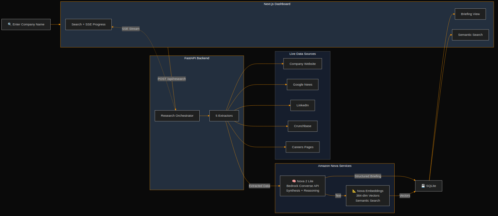

# Scout - AI Company Research Agent

**Built for the Amazon Nova AI Hackathon 2026**

## Hackathon Submissions

| Hackathon | Platform | Track | Status |
|-----------|----------|-------|--------|
| [Amazon Nova AI Hackathon 2026](https://amazonnovaai.devpost.com/) | DevPost | Open | SUBMITTED (no Nova Act key -- geo-blocked, HTTP fallback used) |

## Live Demo & Links

| | |
|---|---|
| **Live Frontend** | [frontend-murex-eta-95.vercel.app](https://frontend-murex-eta-95.vercel.app) |
| **Live Backend API** | [scout-api.astraedus.dev](https://scout-api.astraedus.dev) ([API docs](https://scout-api.astraedus.dev/docs)) |
| **Demo Video** | [youtu.be/t9kPFHv62m4](https://youtu.be/t9kPFHv62m4) |
| **Blog Post** | [How Scout Uses Three Amazon Nova Services](https://builder.aws.com/content/3AccSTscylISyrudUimMDH1sv8k/how-scout-uses-three-amazon-nova-services-to-transform-sales-research) |
| **DevPost** | [devpost.com/software/scout-ixslhg](https://devpost.com/software/scout-ixslhg) |

**Special adaptations**: Added `http_website.py` + `http_news.py` extractors so Scout works without Nova Act API key (geo-blocked outside US). Three modes: mock, http-fallback (requests/BS4 + Bedrock), nova-act.

Scout turns company research from a 30-minute manual task into a 2-minute automated briefing. Type a company name, and Scout's AI agents navigate real websites to gather live data, then synthesize it into actionable intelligence for sales calls and meetings.

## The Problem

Before every sales call or meeting, professionals spend 30-60 minutes manually browsing:
- Company website for products and team info
- LinkedIn for employee count and key people
- Crunchbase for funding history
- Google News for recent developments
- Job boards for growth signals and tech stack

## The Solution

Scout automates this entire workflow:

1. **Input** a company name
2. **Nova Act** navigates 5+ real websites, extracting structured data from each
3. **Nova 2 Lite** synthesizes all findings into a structured briefing
4. **Dashboard** displays the briefing with evidence and talking points

## Key Features

- **Multi-site research**: Extracts data from company websites, LinkedIn, Crunchbase, Google News, and careers pages
- **Live data**: Nova Act browses real websites in real-time (not stale training data)
- **Structured briefings**: Key people, recent news, tech stack, growth signals, competitive landscape, and suggested talking points
- **Graceful degradation**: If a source is blocked or unavailable, Scout still produces a briefing from whatever succeeds
- **Real-time progress**: SSE-powered progress tracking shows each research stage live
- **Research history**: SQLite-backed history of past research jobs

## Architecture



## Tech Stack

| Layer | Technology |
|-------|-----------|
| Frontend | Next.js 14, TypeScript, Tailwind CSS |
| Backend | Python, FastAPI, Uvicorn |
| Browser AI | Amazon Nova Act (website navigation + extraction) |
| Synthesis AI | Amazon Nova 2 Lite via AWS Bedrock (reasoning + structuring) |
| Semantic Search | Amazon Nova Multimodal Embeddings via Bedrock (384-dim vectors) |
| Database | SQLite via aiosqlite |
| Real-time | Server-Sent Events (SSE) |

## Getting Started

### Prerequisites

- Python 3.10+
- Node.js 18+
- AWS account with Bedrock access (Nova 2 Lite)
- Nova Act API key from [nova.amazon.com/act](https://nova.amazon.com/act)

### Backend Setup

```bash
# Create virtual environment
python3 -m venv venv
source venv/bin/activate

# Install dependencies
pip install -r backend/requirements.txt

# Configure environment
cp .env.template .env
# Edit .env with your API keys

# Run (mock mode for testing without API keys)
MOCK_MODE=true uvicorn backend.main:app --reload --port 8000

# Run (production mode with real APIs)
MOCK_MODE=false uvicorn backend.main:app --port 8000
```

### Frontend Setup

```bash
cd frontend
npm install
npm run dev
```

Visit http://localhost:3000

### Test API Connections

```bash
source venv/bin/activate
python scripts/hello_nova_act.py    # Test Nova Act
python scripts/hello_bedrock.py     # Test Bedrock
```

## API

| Method | Endpoint | Description |
|--------|----------|-------------|
| POST | `/api/research` | Start research (body: `{"company_name": "Stripe"}`) |
| GET | `/api/research/{id}` | Get status and results |
| GET | `/api/research/{id}/stream` | SSE progress stream |
| GET | `/api/history` | Recent research history |
| GET | `/api/search?q=` | Semantic search across briefings (Nova Embed) |
| GET | `/health` | Health check |

## How It Uses Amazon Nova

### Nova Act (Browser Automation)
Each extractor uses Nova Act to navigate real websites:
- `act()` for all browser actions — navigation, clicking, and data extraction
- Multiple browser sessions extract data from different sources in sequence
- Graceful error handling for blocked/unavailable sites

### Nova 2 Lite (AI Synthesis)
After extraction, all data is fed to Nova 2 Lite via AWS Bedrock's Converse API:
- Synthesizes raw data into structured JSON briefing
- Generates talking points referencing specific findings
- Assesses data quality and confidence level
- Identifies growth signals and competitive positioning

### Nova Multimodal Embeddings (Semantic Search)
After synthesis, each briefing is embedded using Nova Multimodal Embeddings via Bedrock's InvokeModel API:
- Generates 384-dimensional embedding vectors for briefing content
- Enables semantic search across all past research ("find companies in AI safety")
- Uses `GENERIC_INDEX` purpose for indexing, `TEXT_RETRIEVAL` for queries
- Cosine similarity ranking returns the most relevant briefings
- Fully integrated: embeddings auto-generate after every research job

## Project Structure

```
scout/
  backend/
    main.py              # FastAPI app + orchestration
    config.py            # Environment configuration
    extractors/          # Nova Act browser extractors
      website.py         # Company website extractor
      google_news.py     # Google News search
      linkedin.py        # LinkedIn company page
      crunchbase.py      # Crunchbase funding data
      careers.py         # Job listings extractor
      mock.py            # Mock extractors for development
    synthesis/
      briefing.py        # Nova 2 Lite synthesis
      embeddings.py      # Nova Multimodal Embeddings
      mock_briefing.py   # Mock synthesis for development
    models/
      schemas.py         # Pydantic data models
    db/
      database.py        # SQLite storage
  frontend/              # Next.js dashboard
  scripts/
    hello_nova_act.py    # Nova Act smoke test
    hello_bedrock.py     # Bedrock smoke test
```

## Built By

Diven Rastdus - Full-Stack Developer & AI Engineer

#AmazonNova
